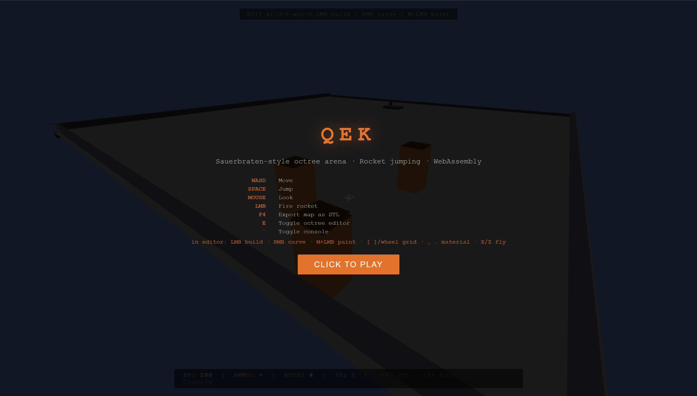
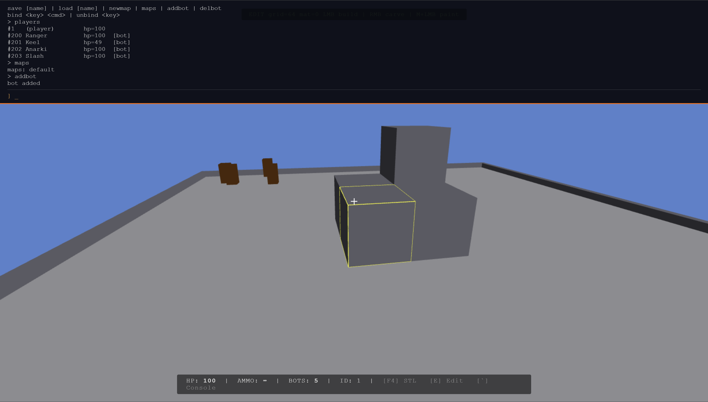
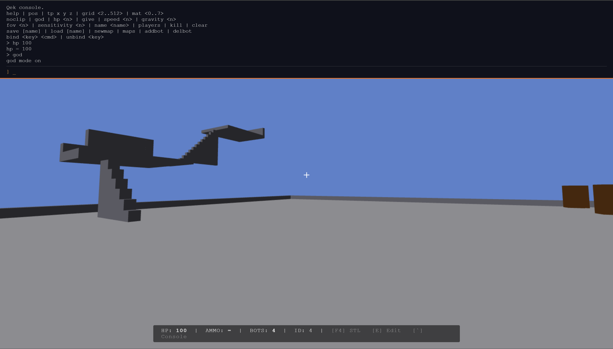

# Qek

**WebAssembly rocket-jumping arena built on a Sauerbraten-exact octree.**

Qek is a small multiplayer arena shooter that runs entirely in the browser as
WebAssembly, with an authoritative Python server over a hand-rolled WebSocket
protocol. Movement and combat follow Quake-style rocket-jump physics
(client-predicted, server-reconciled). Press **E** in-game and the level
itself becomes editable — a Sauerbraten-style click-drag octree editor with
a Source-engine-style console, both backed by the same optimistic-local /
authoritative-server pattern used for player movement, so edits persist to
disk and sync to every connected player live.





```
Language:    C (Emscripten → WASM)
Rendering:   WebGL 1.0 (GLES2), flat-shaded
Networking:  WebSockets (RFC 6455 hand-rolled in pure Python)
Server:      Pure Python stdlib — no third-party deps
Geometry:    10-level 1024³ Sauerbraten-style octree
Export:      Binary STL (in-browser, F4 key)
Map format:  .cmap (custom binary octree stream)
```

## Contents

- [Quick Start](#quick-start)
- [Controls](#controls)
- [Editor](#editor)
- [Architecture](#architecture)
- [Binary Protocol](#binary-protocol)
- [Octree & STL Export](#octree--stl-export)
- [Rocket Physics](#rocket-physics)
- [Extending](#extending)

---

## Quick Start

### 1. Install Emscripten

```bash
git clone https://github.com/emscripten-core/emsdk.git
cd emsdk
./emsdk install latest
./emsdk activate latest
source ./emsdk_env.sh
```

### 2. Build

```bash
make          # Builds www/game.js + www/game.wasm
```

### 3. Run

```bash
make run
# or:
cd server && python3 server.py
```

Open `http://localhost:8765` in your browser.

---

## Controls

| Key / Input  | Action              |
|-------------|---------------------|
| `WASD`       | Move                |
| `Space`      | Jump                |
| `C`          | Crouch (lowers eye/rocket-spawn height, halves ground speed) |
| `Mouse`      | Look (Pointer Lock) |
| `LMB`        | Fire rocket         |
| `F4`         | Export map as STL   |
| `E`          | Toggle octree editor |
| `` ` ``      | Toggle console       |

Ground movement has no coasting: releasing WASD zeroes your horizontal
velocity almost instantly (`physics_apply_input` in `physics.c`) rather than
sliding to a stop, while acceleration/turning while a key is held is
unchanged. Rockets never have gravity applied (pure `pos += vel*dt` on both
client and server).

Rockets launch from below your eye rather than dead-center — the muzzle point
is offset a fixed amount straight down in world space, then the shot
re-targets the exact point the reticule is aiming at (the same convergence
trick real FPS weapon viewmodels use), so despite visibly originating lower
it always flies toward what the crosshair says. The offset is deliberately
world-space rather than camera-space: a camera-relative "down" rotates to
point mostly sideways once pitch gets steep (gimbal lock, same issue any
roll-free FPS camera basis has), which would shove the muzzle sideways at
exactly the aim angle rocket jumps use — a world-down offset has no such
singularity at any pitch. Both the offset and the convergence distance are
kept small (`ROCKET_MUZZLE_DOWN`/`ROCKET_CONVERGE_DIST` in `physics.h`) —
worst-case lateral deviation from the true aim line is bounded by the offset
itself, and a convergence distance tuned to this arena's actual scale (not
some arbitrary long-range default) means most real shots are visually close
to dead-center for their whole flight, not just at one specific distance.
The rendered rocket box rotates to point along its
actual travel direction, not the raw view direction.

Crouch is bound to `C`, not `Ctrl` — `Ctrl+W` is a browser-reserved "close tab"
shortcut that `preventDefault()` cannot block, so `Ctrl` isn't safe to combine
with any movement key. Escape has the same non-overridable-shortcut problem
(browsers reserve it to exit pointer lock, and can swallow the keydown
entirely when that's what triggered it) — the console's `open` state is kept
in sync by watching `InputState.pointer_locked` directly rather than relying
on ever seeing an Escape keydown.

**Rocket jumping**: aim straight down, jump (`Space`) and fire (`LMB`) in the
same motion — crouching is not required. The explosion impulse stacks
additively with your velocity — you keep momentum in the air (Quake-style
`sv_airaccelerate`). Self-splash knockback is boosted
(`ROCKET_SELF_KNOCKBACK_MULT`, 1.6×) relative to what the same blast does to
anyone else, so jumps launch you noticeably higher, and rockets never damage
their own owner at all — only other players take splash damage. Self-splash
falloff is measured from your feet rather than your eyes, so the boost is the
same whether you're standing or crouched (`C`) — crouching still lowers the
muzzle and halves ground speed if you want it, it just isn't needed for a
strong jump anymore.

Splash damage/knockback is occlusion-checked — a rocket that hits the far
side of a wall or floor you've built won't hurt you through it, on both
client (bots, `rocket_explode()` in `physics.c`) and server (real players,
`_explode()` in `server.py` + `mapdata.ray_cast()`). This surfaced a real bug
in the octree's ray cast itself (`octree.c`'s `_ray_vs_aabb`): when a ray's
origin starts inside a node — true for the root on almost every cast, since
rays always start somewhere inside the world — it was returning that node's
far exit distance instead of `0`, which made short-range casts (rocket
flight, this occlusion check) wrongly reject nodes the ray origin was
sitting right inside of. Fixed at the source, so it also improves general
rocket wall-collision and editor targeting accuracy, not just this check.

---

## Editor

Press **E** to enter a Sauerbraten-style octree editor: the local player
switches to noclip fly (`WASD` + `X`/`Z` for up/down, hold `Shift` to sprint)
and a wireframe cube tracks whatever grid cell the crosshair is over.

| Input             | Action                                             |
|-------------------|-----------------------------------------------------|
| `LMB` drag        | Sweep a box and build solid outward from the face  |
| `RMB` drag        | Sweep a box and carve empty inward from the face   |
| `M` + `LMB` drag   | Repaint face material without changing geometry     |
| `[` / `]` or wheel | Decrease / increase grid size (2..512)            |
| `,` / `.`         | Cycle current paint material (0..7)                |

Every drag is exactly **1 grid unit deep** — repeat drags to build up
thicker structures. The world (`WORLD_SIZE` in `octree.h`) is 1024³, four
times the footprint of the default arena, so there's a lot of open space
around it to build into — the crosshair/highlight and `physics.c`'s hard
player-bounds clamp both follow `WORLD_SIZE`, not the old arena size. Even
if you carve away every cube in the map, the editor still lets you target
the implicit `y>=16` floor plane physics.c hard-clamps every player to, and
build back up from it — rendered as a light-grey reference plane sized
exactly to `WORLD_SIZE`, matching the true editable/highlightable bounds
(real geometry always draws over it; the blue clear color behind
everything else is just the skybox). Back-face culling is off,
so both sides of every triangle
(world geometry, players/bots, the reference plane) render correctly —
noclip flight can put the camera behind/inside geometry in ways normal
collided play never could. Each commit is applied locally right away and sent to
the server, which is authoritative: it persists the edit to
`maps/<name>.cmap` and rebroadcasts the resulting map to every connected
client, so edits survive reconnects and server restarts.

Press **`` ` ``** to open a Source-engine-style console. Commands:

```
help                 list commands
clear                clear the console log
pos                  print player position
tp x y z             teleport
name <name>          rename yourself
players              list connected players/bots with hp
kill                 force your own respawn
grid <2..512>        set editor grid size
mat <0..7>           set current paint material
noclip               toggle editor mode
god                  toggle damage/knockback immunity (independent of noclip)
hp <0..500>          set your own HP
give                 restore HP to 100
speed <n>            set ground move speed (default 280)
gravity <n>          set gravity (default 600, 0 = none)
fov <30..150>        set field of view (default 75)
sensitivity <n>      set mouse look sensitivity (default 0.002)
skybox r g b         set the sky/clear color (each 0..1)
save [name]          save the current map to disk (default: "default")
load [name]          load a named map from disk, broadcast to everyone
newmap               regenerate the default arena, broadcast to everyone
maps                 list maps saved on the server
addbot               spawn one more bot (up to 8 total)
delbot               remove the most-recently-added bot
bind <key> <cmd>     run <cmd> whenever <key> is pressed (browser code,
                     e.g. KeyG, Digit1, F5 — outside the console/editor)
unbind <key>         remove a bind
```

`speed`/`gravity`/`fov`/`sensitivity`/`hp`/`kill` are client-local tuning —
if you're connected to a server, its authoritative corrections (position,
hp) will eventually pull things back in line, so treat them as local
feel/debug knobs rather than a way to change shared game rules. `god` and
`noclip`'s immunity, `name`, `save`/`load`/`newmap`/`maps`, and
`addbot`/`delbot` are unaffected by that since they either go through the
server or stay purely local to your own bot roster.

---

## Architecture

```
project/
├── server/
│   ├── server.py           Pure Python HTTP + WS server (RFC 6455 by hand)
│   └── mapdata.py          Python port of octree.c/cmap.c — authoritative
│                            map state, edit ops, .cmap save/load
│
├── client/
│   ├── main.c              Entry point, Emscripten game loop
│   ├── octree.c/h          10-level 1024³ octree, AABB region edits, ray collision
│   ├── octree_render.c/h   Face extraction → WebGL VBO, face culling
│   ├── octree_stl.c/h      Binary STL export (in-browser download)
│   ├── cmap.c/h            .cmap map format (depth-first node stream, v2)
│   ├── editor.c/h          Sauerbraten-style click-drag box editor
│   ├── console.c/h         Source-engine-style command console
│   ├── physics.c/h         Quake movement, rocket physics, explosion impulse
│   ├── renderer.c/h        WebGL shaders, camera, world/player/rocket/wire draw
│   ├── net.c/h             Emscripten WebSocket client, binary protocol
│   ├── input.c/h           Keyboard + Pointer Lock mouse, input state
│   └── library_ws_stub.js  Emscripten JS library placeholder
│
├── maps/
│   └── default.cmap        Authoritative arena, generated + saved by the
│                            server on first boot, updated on every edit
│
├── www/
│   ├── index.html          Canvas, HUD, console/editor overlay, module loader
│   ├── game.js             (generated by emcc)
│   └── game.wasm           (generated by emcc)
│
└── Makefile
```

---

## Binary Protocol

All packets are binary (little-endian). One byte type prefix.

| Type | Dir | Payload |
|------|-----|---------|
| `0x01 HELLO` | C→S / S→C | C→S: `name[16]` · S→C: `id: u8` |
| `0x02 STATE` | S→C | `n: u8` then `n × player_state (25 bytes)` |
| `0x03 INPUT` | C→S | `seq: u16, yaw: f32, pitch: f32, keys: u8` |
| `0x04 SPAWN_ROCKET` | S→C | `id: u8, owner: u8, pos: 3×f32, vel: 3×f32` |
| `0x05 EXPLODE` | S→C | `rocket_id: u8, pos: 3×f32` |
| `0x06 DAMAGE` | S→C | `player_id: u8, delta_hp: i8` |
| `0x07 OBITUARY` | S→C | `killer: u8, victim: u8` |
| `0x08 FIRE` | C→S | `yaw: f32, pitch: f32, crouch: u8` |
| `0x09 EDIT_REGION` | C→S | `op: u8 (0=empty,1=solid,2=material), face: u8, mat: u8, minx,miny,minz,maxx,maxy,maxz: u16` |
| `0x0A MAP_FULL` | S→C | raw `.cmap` bytes — sent on connect and after every edit/save/load |
| `0x0B SAVE_MAP` | C→S | `name_len: u8, name: bytes` |
| `0x0C LOAD_MAP` | C→S | `name_len: u8, name: bytes` |
| `0x0D CONSOLE_MSG` | S→C | `len: u16, utf8: bytes` — echoed into the client console log |
| `0x0E NEW_MAP` | C→S | no payload — regenerate the default arena, save, broadcast |
| `0x0F LIST_MAPS` | C→S | no payload — server replies with a `CONSOLE_MSG` listing `maps/` |

**player_state** (25 bytes):
`id: u8, x y z: 3×f32, vx vy vz: 3×f32, yaw: f32, hp: u8`

---

## Octree & STL Export

The world uses a Sauerbraten-exact octree:
- **10 levels**, **1024³ world units** — the default arena only occupies the
  `[0,256)` corner of this space; everything beyond it starts empty, open
  for the editor to build into
- Leaf size: **2 world units**
- Each node: `EMPTY | SOLID | DEFORMED | SUBDIVIDED`
- `DEFORMED` nodes have 8 corner height offsets (`i8`) — same as Cube 2

The default arena's interior carve sweeps a 3×3×3 grid of segments per axis
(`octree_make_default_map()` in `octree.c`, ported line-for-line in
`mapdata.py`) rather than one uniform-size cube per combination — the three
segments (128/64/32 units) aren't the same size, so a cube sized for one axis
silently left most combinations only partially carved, leaving roughly
three-quarters of the intended open interior as solid, uncarved rock (mostly
contiguous with the outer wall, so not visually obvious as "extra" geometry).
This was hit via a Sauerbraten-scale-authentic rocket-jump apex reproduced in
a native test harness (`octree_is_solid()` mapped across a horizontal slice
at several heights) rather than by eyeballing the level. If you have an
existing `maps/default.cmap` on disk, it was generated before this fix and
still has the old broken geometry — run the console's `newmap` command once
connected to regenerate it correctly (this won't touch any other saved map
name).

**STL Export (F4):**
- Walks the octree, collects all exposed faces
- Non-planar quads split on shorter diagonal (Sauerbraten convention) → watertight mesh
- Binary STL format, triggers browser download as `map.stl`
- Ready for Blender, PrusaSlicer, or your habitat pipeline

**.cmap Format (v2):**
- 32-byte header: `"CMAP"`, version `u16` (= 2), `world_size u8`, reserved
- Depth-first node stream. SOLID includes `faces[6] u8` (materials now
  persist on flat cubes, not just heightfield geometry). DEFORMED includes
  `corners[8] i8` + `faces[6] u8`.
- The server's `mapdata.py` implements the identical format, so bytes read
  straight off the WebSocket can be handed to the client's `cmap_deserialize()`.

---

## Rocket Physics

```c
// On explosion, per affected player:
vec3  delta   = player_eye_pos - explosion_pos;
float frac    = 1.0 - dist / ROCKET_RADIUS;   // 0..1
float mult    = is_owner ? ROCKET_SELF_KNOCKBACK_MULT : 1.0f;
vec3  impulse = normalize(delta) * frac * ROCKET_FORCE * mult;
player.vel   += impulse;   // additive — stack-able!

// Rockets never damage their own owner, only other players.
// Self-splash knockback is boosted instead, for higher rocket jumps.
```

Key constants (tune in `physics.h`):

| Constant | Value | Effect |
|----------|-------|--------|
| `ROCKET_FORCE` | 900 | Blast impulse strength |
| `ROCKET_RADIUS` | 120 | Explosion radius |
| `ROCKET_SELF_KNOCKBACK_MULT` | 1.6 | Self-splash push multiplier (rocket-jump height) |
| `ROCKET_MUZZLE_DOWN` | 8 | Muzzle offset below the eye (bottom-center launch point) |
| `ROCKET_CONVERGE_DIST` | 120 | Distance the muzzle-offset shot re-converges onto the reticule |
| `AIR_ACCEL` | 10 | Air strafe acceleration |
| `MOVE_SPEED` | 200 | Ground speed |

---

## Extending

**Add a new weapon**: add a packet type, create a `Weapon` struct analogous to `Rocket`, implement projectile physics in `physics.c` and server `tick()`.

**Edit the map**: modify `octree_make_default_map()` in `octree.c` or load a `.cmap` file via `cmap_load()`.

**Vertex colours / textures**: the VBO already carries a `mat_id` float per vertex. The fragment shader receives it via `v_mat_id` — just look up into a palette texture or a uniform array.

**Bot AI**: add a `Bot` struct with a simple state machine (ROAM → AIM → FIRE → ROCKETJUMP). Pathfinding can walk the octree leaf nodes.
